# HTAM--SLEEPY-SLIPPERS: FROM MASS TO PERSONAL PRODUCTION

HTAM stands for How Things Are Made, a course offered by the College of Design and Innovation at Tongji University. In this course, we learn various manufacturing techniques. 
This project is one of the course assignments, exploring how to optimize mass production techniques so that they can be used in small-scale/personalized settings.

Our research topic is **How might we reinterpret foaming slippers using living biological materials in natural environments?**

## Project Overview

This project explores an alternative, low-tech approach to the industrial **compression molding with foaming** process, traditionally used for manufacturing products like foam slippers. Instead of relying on chemical foaming agents (e.g., in PVC/EVA), we draw inspiration from natural expansion processes: **seed germination** and **dough fermentation**.
Our goal is not to replicate the industrial product's durability or efficiency, but to creatively reinterpret the core principle of "expansion molding" in a sustainable, non-toxic, and accessible way, suitable for a FabLab setting.

## Design Challenge

- **Industrial Process:** Compression Molding (Foaming)
- **Reinterpretation Tools/Materials:** Seeds (Mung Beans, Chia) & Dough (Yeast)
- **Context:** Small-scale / Low-tech / FabLab Space

## Background Research

The industrial process for making foam slippers involves three key steps under high heat and pressure:
1.  **Pre-heating (~130°C):** Preparing the unfoamed material.
2.  **Molding & Foaming (~160-165°C):** The material expands (foams) inside the mold due to chemical agents.
3.  **Curing:** The foam structure is set under controlled conditions.

**Limitations we identified:**
- Use of potentially toxic plasticizers.
- High energy consumption.
- Limited potential for customization.

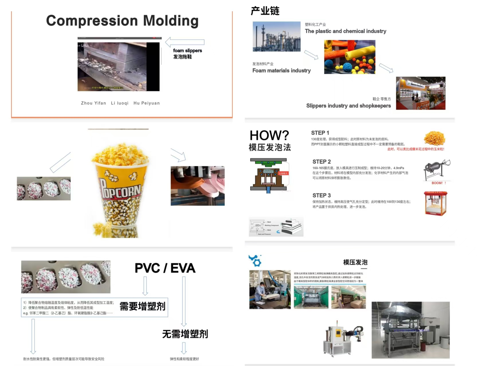

## Our Reinterpretation: Two Bio-Foaming Paths

### Path 1: Seed Germination Foaming

**Concept:** Using the natural swelling force of germinating seeds to act as a "bio-foaming" agent within a gel matrix.

- **Materials:** Mung beans, chia seeds, agar (or other gel), water, 3D-printed or laser-cut molds.
- **Process:**
    1.  Mix seeds into a liquid gel solution.
    2.  Pour the mixture into a mold.
    3.  Keep the mold in a humid environment to encourage germination and expansion.
    4.  The growing seeds displace the gel, creating a dense, foamed structure.

     
### Path 2: Dough Fermentation Foaming（this path is abandoned now）

**Concept:** Utilizing the gas produced by yeast fermentation to cause dough to rise and expand within a mold, mimicking the foaming process.

- **Materials:** Flour, yeast, sugar, water, mold.
- **Process:**
    1.  Prepare a yeast-activated dough.
    2.  Place the dough into a mold.
    3.  Allow the dough to proof (ferment and rise), filling the mold's volume.
    4.  Bake or dry the dough to set its expanded shape.（BREADDDD SLIPPERS??!）
 
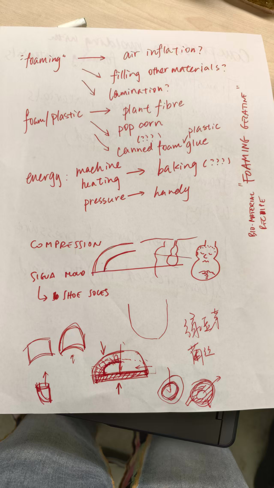

 
## Process

### prototyping
We attempted to create a prototype of a "seed slipper" using some waste materials. We made the bottom surface in the shape of a slipper and simulated the positions where plants sprout on it; we fixed it with a transparent mold on the top and added a grid at the bottom to secure the seeds.

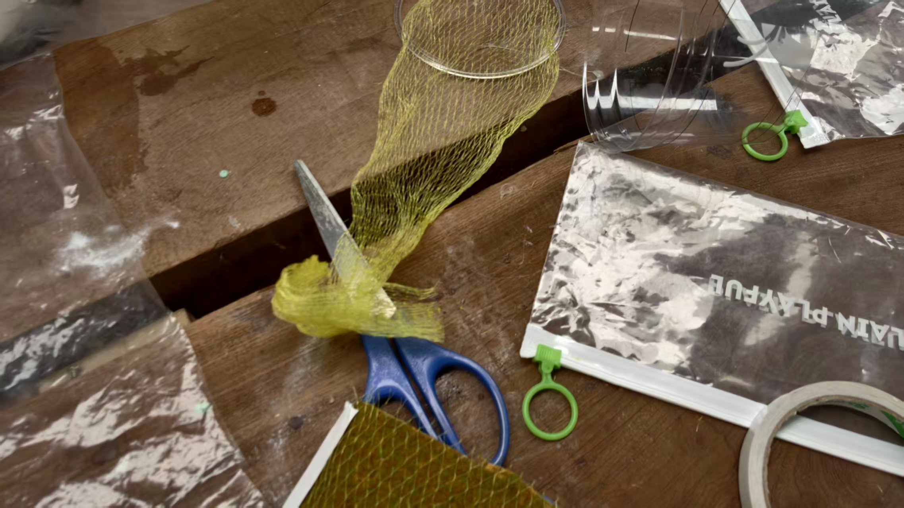

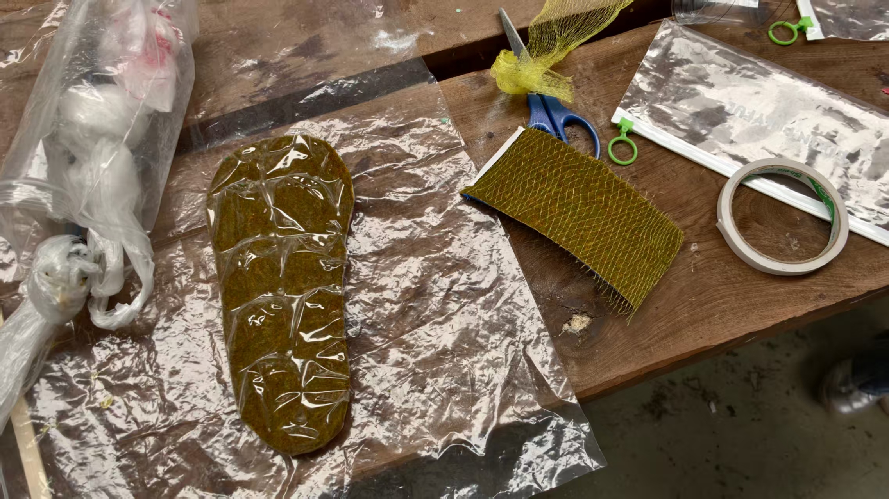

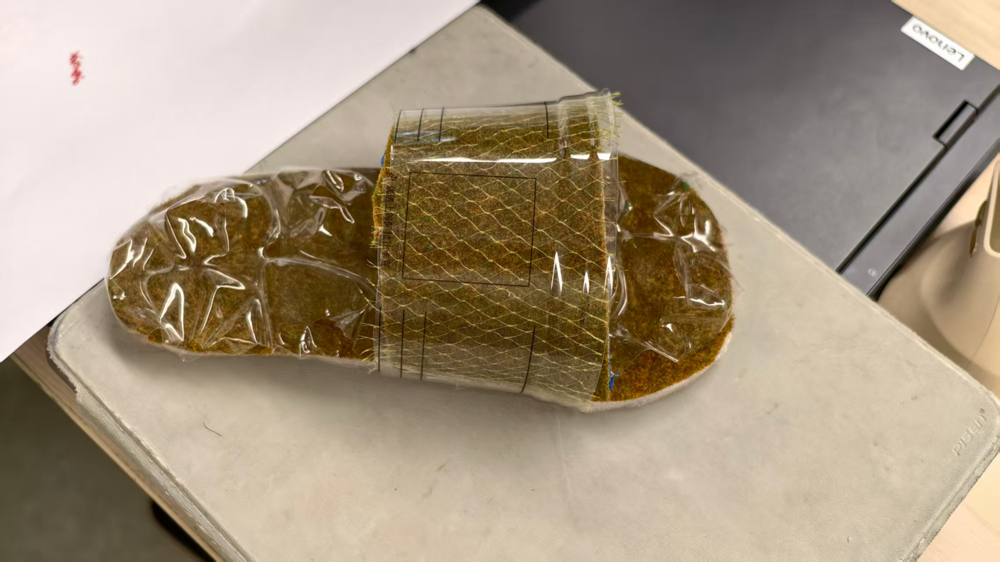

Our expected design is to replace the "downward pressure of the mold" with the "outward supporting force of the seed", and to substitute the "mold" with a "container that shapes the seedling of the seed", while omitting the high-temperature step.
The key point is that the slippers produced through this process are basically impossible to wear directly... In this project, what we pursue is not a "100% reproduction of the functions and manufacturing techniques of the product", but to understand the elements involved and then innovatively propose some seemingly impossible alternative solutions. We sincerely hope that this still meets the class requirements.
From the perspective of plant growth, when they wither, perhaps a pair of somewhat sturdy plant-shaped slippers can be formed... This requires experimentation.

I conducted some experiments. It can be seen that I only molded the shape of the sole part of the shoes but did not yet make the upper part of the slippers that covers the foot. Green beans（绿豆） and chia seeds were respectively cultivated on the two surfaces of the sole. Since chia seeds are an invasive species in China, they were deactivated as food - but unfortunately, they still germinated. This is the germination situation of the two plants three days later. I will bring them to class.

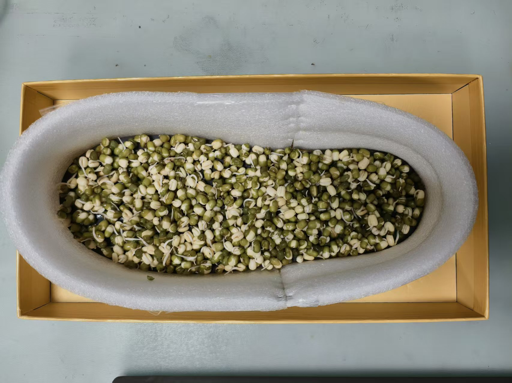

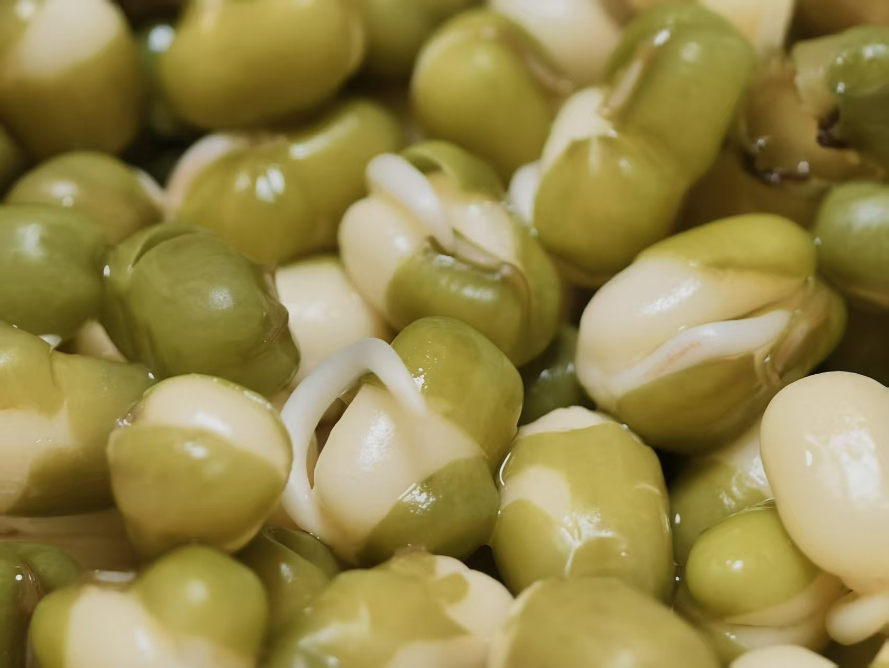

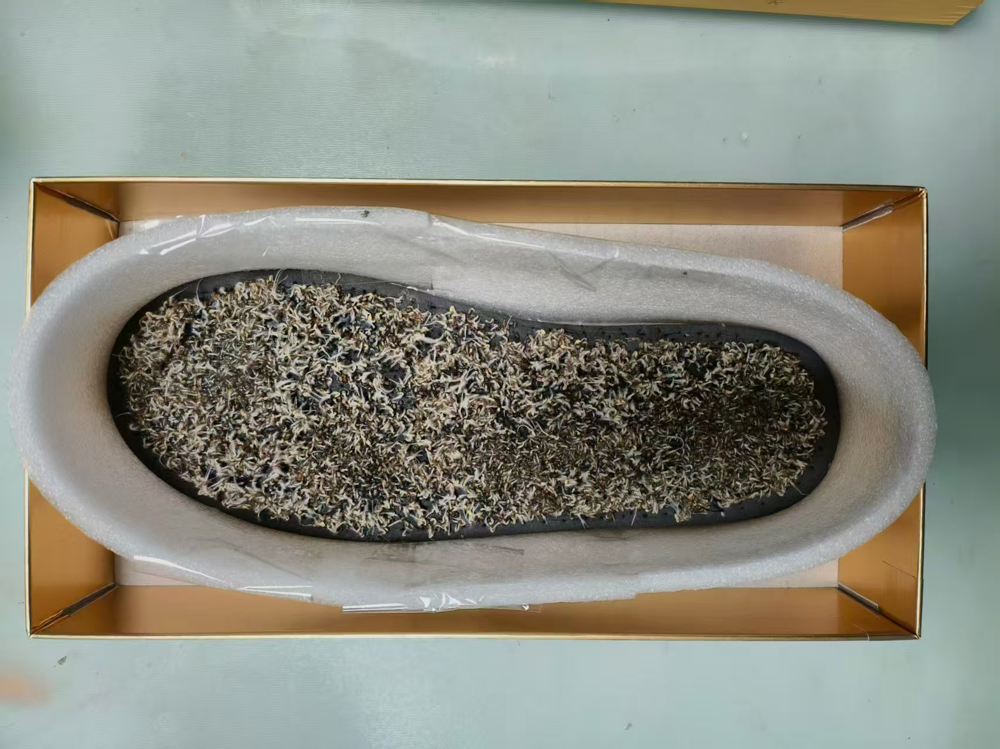

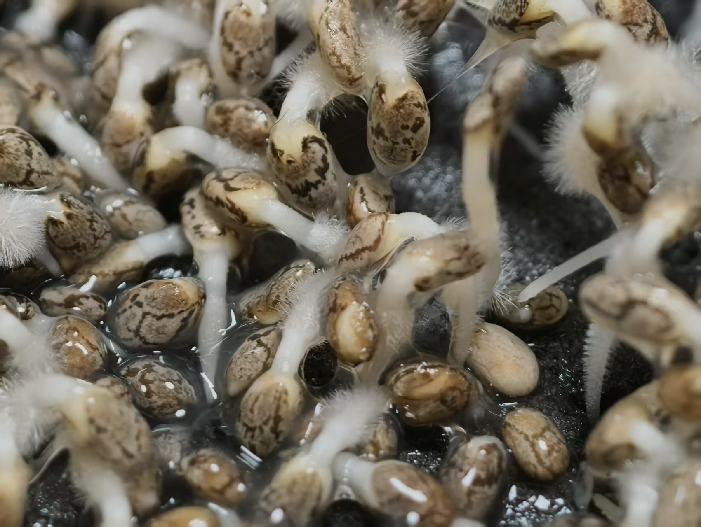

We tried another scheme related to mycelium. We chose the method of making the traditional Indonesian food "tempeh" and fermented several types of beans. First, we soaked the beans, then peeled and cooked them, mixed in tempeh mycelium powder, and placed them in a constant temperature box at 35-40 degrees for mycelium fermentation. During this process, we used growth molds wrapped in the shape of insoles so that it could be shaped during the growth process.

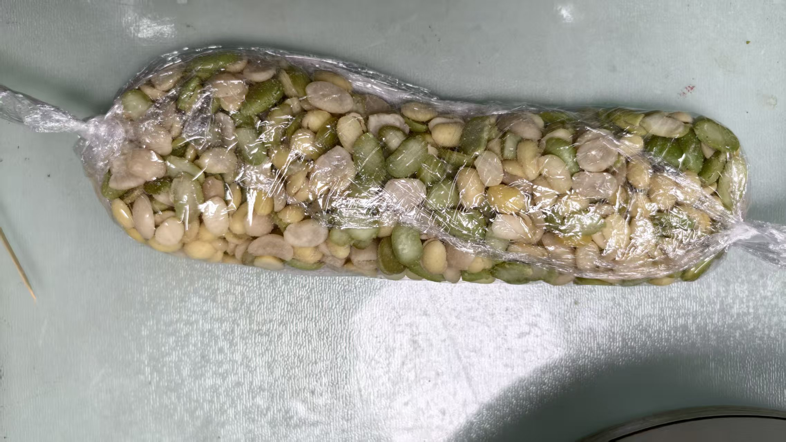
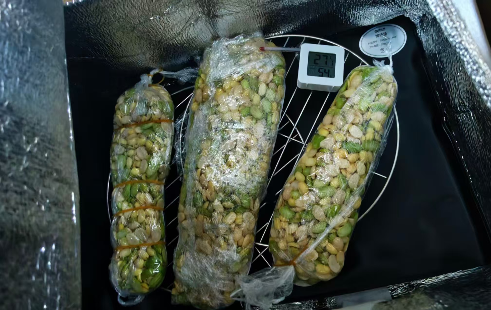

Tempeh does have a strong shaping effect and the mycelium growth is also very good... But I overlooked one point: it has a very strong smell before being cooked. Since I didn't cook it before the presentation, it smelled particularly bad.

We made another attempt, and this is the version I think works the best so far: We chose a large sigua net, then trimmed it, removed the seeds inside, and cut it into the shape of a slipper - placing a cushion inside and it looks like a slipper that can be worn directly.
The morning glory has a minor issue: if using the ready-made morning glory material, it cannot achieve the "foaming" effect, and it is also difficult to ensure that the size fits properly. Therefore, we have envisioned a workflow: first, put a mold on the growing morning glory to allow it to grow inside the mold - when the morning glory becomes a morning glory net, it might be able to take on the shape we desire, matching the personalized shape of the feet.

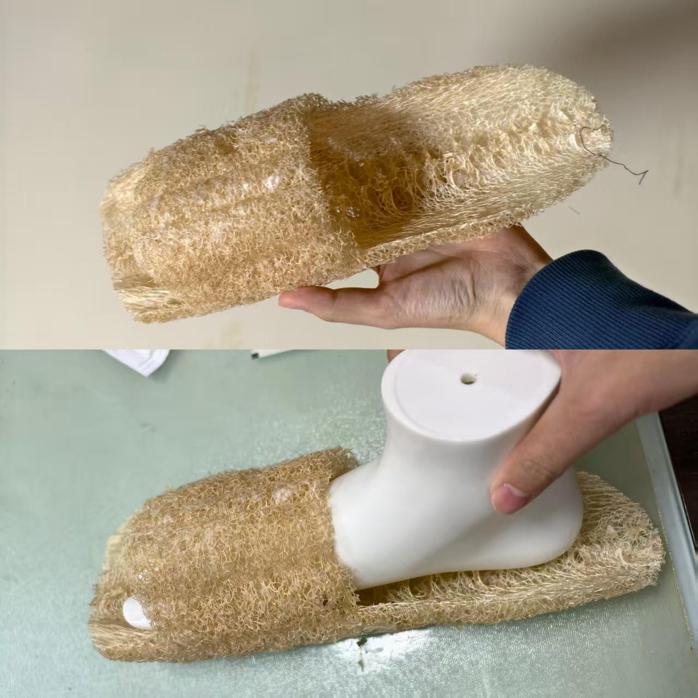

### Optimize and iterate
We create a custom foot model using plaster on the current progress. Then, seeds are sown on the surface of the foot model, allowing seeds to make tosprout on the surface of thefoot model to form an
interconnected surface. Simultaneously, tempeh
fungus mycelium can alsobe used for shaping.. Once the mycelium has fully grown, a pair of custom-made slippers that fit the shape of the foot can be produced.

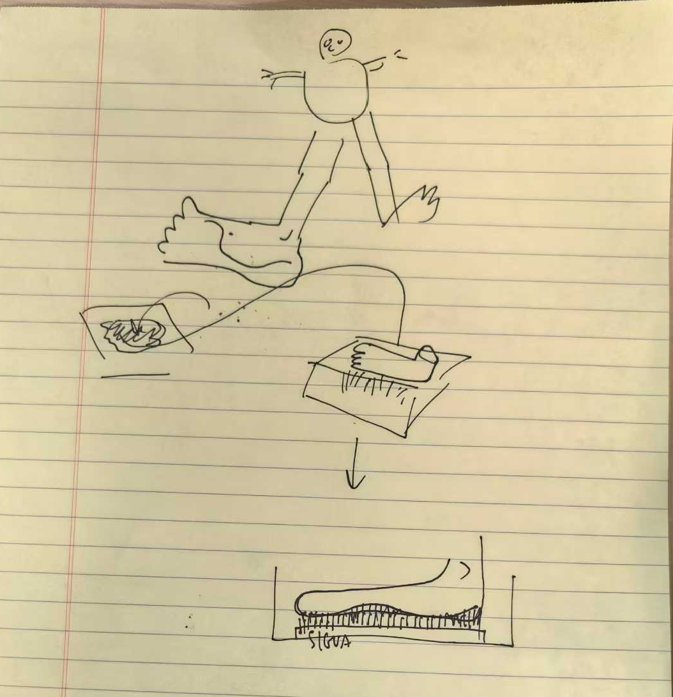

## The final poster

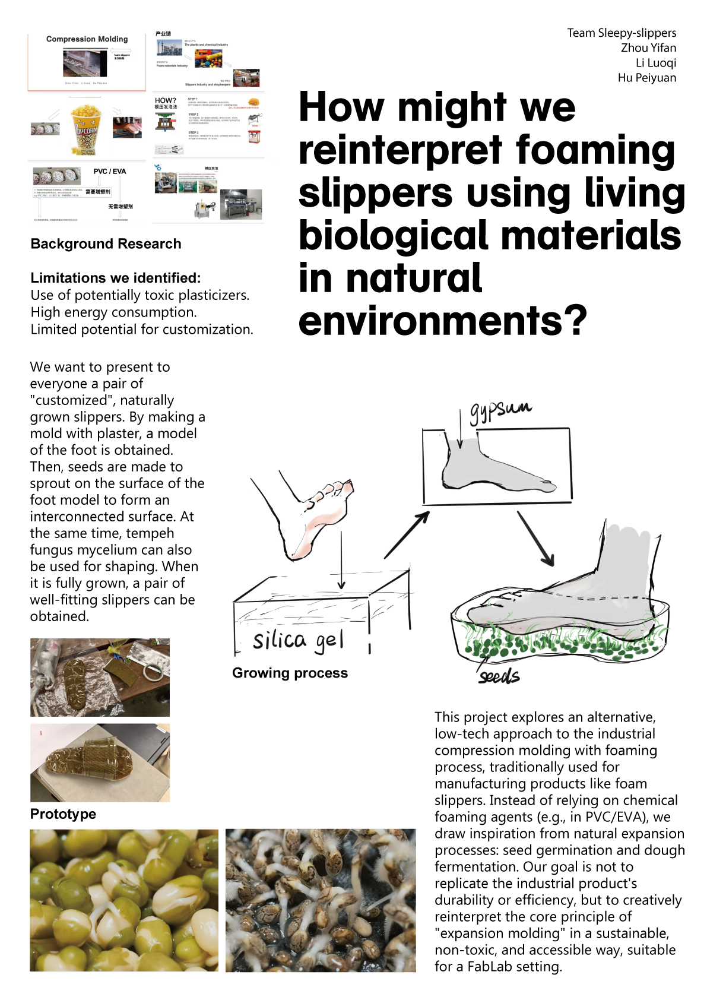

## Reflection & Insights

### Advantages
 **Non-Toxic:** Eliminates the need for synthetic plasticizers and foaming agents.
 **Sustainable:** Utilizes biodegradable and renewable materials.
 **Customizable:** The mold can be easily modified in a FabLab (e.g., via 3D printing) for personalized designs.
 **Low-Tech & Accessible:** The process requires minimal energy and no industrial machinery.

### Challenges
 **Time-Consuming:** Germination and fermentation are slow compared to industrial cycles.
 **Structural Integrity:** The bio-materials lack the strength and durability of industrial polymers.
 **Control:** Managing humidity for seeds and temperature for dough is crucial and can be unpredictable.

### Future Possibilities
 Exploring composite materials (e.g., mycelium with seeds).
 Using digital fabrication to create molds that guide growth patterns.
 Testing other natural expanding materials like sponges or moss.

## Feedback we received at Maker Faire 2025
1. Some people, after learning about our project, felt it resembled Kenya Hara's concept of using alternative technologies to interpret existing designs, as described in *Designing Design*.
2. Many people were concerned about whether the slippers we made would be wearable.
3. Some people found our project concept interesting and eye-catching.
4. Some people were curious about the types of plants we used.
5. A significant number of people were excited upon seeing the loofah（sigua） slippers: "Sigua!"
6. Some people mentioned that if the project were to be implemented, we could explore and optimize its comfort.
7. People placed great importance on the project's feasibility, with many curious about its wearability and durability.
8. People liked biomaterials, finding them particularly environmentally friendly, but hoped we could find more suitable alternatives, such as composite biomaterials.
   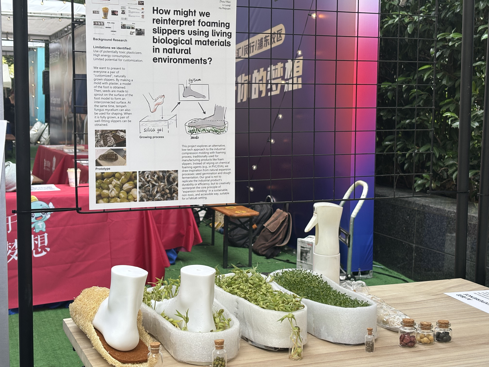
   

# Future Direction Statement
1. Material Optimization and Composites Research: Integrating diverse biomaterials (e.g., mycelium + seeds, alginate + plant fibers) to enhance structural strength and durability.
Objective: To develop a "biobubble" composite material that is closer to wearable performance.
Experimental direction: Test the influence of different proportions, laminating methods, drying/curing processes on material properties.

2. Growth guidance and morphological control research direction: Using digital design and manufacturing technology (such as parametric modeling, 3D printing mold) to accurately guide the growth path of plants or mycelium.
Objective: Achieve more complex structural molding and personalized customization.
Tools: Rhino + Grasshopper, and bio-printing platforms (e.g., BioBricks).

3. User experience and comfort research Research direction: Test the adaptability, breathability and anti-slip of different materials to the skin.
Objective: To enhance the practicality and comfort of the product while maintaining the ecological concept.

4. Life cycle and degradation path design research direction: Systematic study of the whole life cycle of products from "growth" to "degradation", including composting conditions, degradation time, soil impact, etc.
Objective: To achieve a truly closed-loop design "from nature and back to nature".

# Possible evolutions and collaborations 
1. Material science research institutions, such as university material schools and biomaterial laboratories. Cooperation content: jointly develop bio-composites, conduct mechanical property tests and component analysis.
2. Agricultural or botanical research team collaboration: screen plant varieties suitable for rapid prototyping and controlled growth, and optimize germination environment.
3. Cooperation content of mycelium material development company: introduce mature mycelium molding technology, combine with seed germination mechanism, and develop new mixed materials.
4. Sustainable design platform or exhibition cooperation content: The project will be exhibited and promoted as a sustainable design case, attracting public and industrial attention.
5. FabLab / Maker Space Network collaboration: Launch open collaborative projects, inviting community members to co-experiment and iteratively refine design and manufacturing processes.
6. Footwear or home brands (sustainable direction) collaboration content: Explore the application of biomolding technology in limited edition products or concept products to promote industry innovation.
   
Meanwhile, to all those who have been following this project and have read this document - we are extremely grateful for your support and suggestions. If you wish to delve further into the project of creating wearable slippers using biological materials and seed growth, or to conduct further research on improving the industrial process of compression molding through composite biological materials, please refer to all our current somewhat rudimentary research results and feel free to contact us at any time.

## Short-term Action Plan 
1. Material Composite Experiment (Mycelium + Seeds) Materials Lab + Team
2. User Testing and Feedback Collection Design School / Community Workshop
3. Participate in Bio-design competition
   
## Team Members
- Zhou Yifan
- Li Luoqi
- Hu Peiyuan

